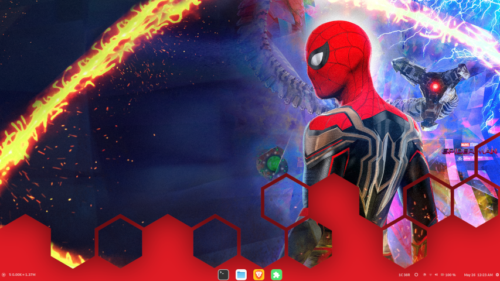
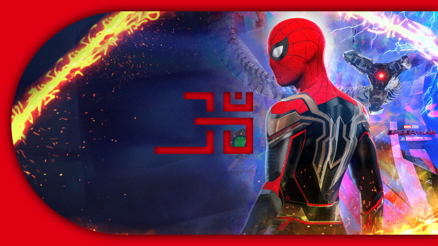
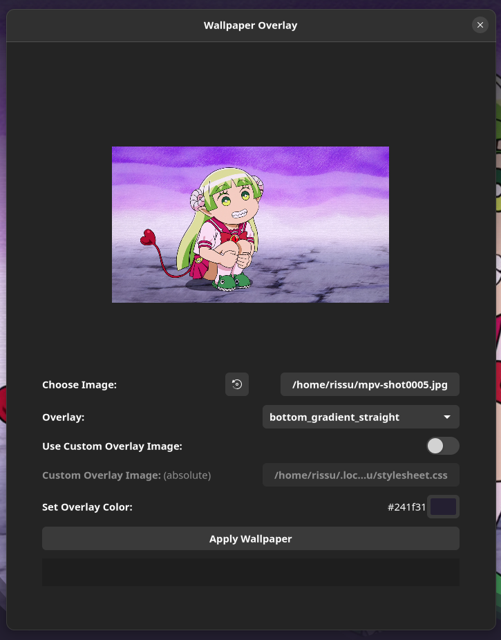

# Wallpaper Overlay

A Gnome extension to apply overlays on wallpaper.

## Table of Contents

- [Wallpaper Overlay](#wallpaper-overlay)
  - [Table of Contents](#table-of-contents)
  - [Screenshots](#screenshots)
  - [Motivation](#motivation)
  - [Features](#features)
  - [Getting Started](#getting-started)
    - [Prerequisite: Install Gnome Tweaks](#prerequisite-install-gnome-tweaks)
    - [Prerequisite: Install Gnome Extensions Manager or Gnome Extensions](#prerequisite-install-gnome-extensions-manager-or-gnome-extensions)
      - [Setting Up Gnome Extensions Manager](#setting-up-gnome-extensions-manager)
      - [Setting Up Gnome Extensions](#setting-up-gnome-extensions)
    - [Install Wallpaper Switcher from Gnome Extensions](#install-wallpaper-switcher-from-gnome-extensions)
    - [Install Wallpaper Switcher from source](#install-wallpaper-switcher-from-source)
  - [Contributing](#contributing)
  - [License](#license)
  <!-- - [Thanks to](#thanks-to) -->

## Screenshots

Original                   |  Modified
:-------------------------:|:-------------------------:
  |  



<!-- ## Updates

The new release packs the following new features.
* Better implemented code. -->

## Motivation

I have a habit to change my wallpaper more frequently. And there were some problems I faced on a regular basis:

- I needed to change my dock colour everytime I change my wallpaper so that It may feel consistent with the wallpaper.
- If my dock was transparent then for some wallpapers the color of dock area was so light that the text were barely visible.
- Adding a solid color to dock sometimes gave the feeling that the dock and wallpaper are two separate entities and if I put gradient on the dock then the gradient looked weird as it ranged on the very short heighted dock.
- I made this extension to solve these problems, but while in the making, I realised that It has huge potential. Like I can imagine a huge set of several innovative overlays which make the Linux desktop experience more pleasing.

## Features

This extension has following features:

- Apply an overlay on wallpaper in four easy steps
  - Choose image : Either take the currently set wallpaper or choose it manually through the file picker
  - Choose overlay : Either choose it from the default library or select a custom svg overlay
  - Choose color : Each overlay has one colour that can be modified to the colour you choose here. In the svg file this colour is #0000ff
  - Click apply and the overlay will be applied and wallpaper will be set.
- You can even apply multiple overlays by:
  - Apply one overlay
  - Reselect current set wallpaper
  - Apply second overlay and so on.
- You can create your own svg overlays in inkspace and apply them. Copy any overlay file present in /src/resources/ in this repo and edit it in inkspace to create your own overlay file.
  - Note: The color #0000ff in the overlay file will be replaced by the user selected color.

## Getting Started

To use this extension, you will need

- Gnome 42 or later

### Prerequisite: Install Gnome Tweaks

For Ubuntu,

```bash
sudo add-apt-repository universe
sudo apt install gnome-tweaks
```

For Fedora,

```bash
sudo dnf install gnome-tweaks
```

For Arch Linux,

```bash
sudo pacman -S gnome-tweak-tool
```

You may find Gnome Tweaks for other distributions as well. Install them accordingly.

### Prerequisite: Install Gnome Extensions Manager or Gnome Extensions

I recommend using Gnome Extensinos Manager as it would make your life easier. Gnome Extensions needs few extra steps to be done

#### Setting Up Gnome Extensions Manager

For Ubuntu,

```bash
sudo add-apt-repository universe
sudo apt install gnome-shell-extension-manager
```

For Fedora,

```bash
sudo dnf install gnome-shell-extension-manager
```

For Arch Linux,

```bash
sudo pacman -S gnome-shell-extension-manager
```

You may find Gnome Extension Manager for other distributions as well. Install them accordingly.

#### Setting Up Gnome Extensions

For Ubuntu,

```bash
sudo add-apt-repository universe
sudo apt install gnome-shell-extensions
```

For Fedora,

```bash
sudo dnf install gnome-shell-extensions
```

For Arch Linux,

```bash
sudo pacman -S gnome-shell-extensions
```

You may find Gnome Extension for other distributions as well. Install them accordingly.

After installation, open your browser and go to [Gnome Extension Website](https://extensions.gnome.org)

You would be asked to add a browser extension, install the extension. Now you are ready to install Gnome Extensions.

### Install Wallpaper Switcher from Gnome Extensions

If you are using Gnome Extensions Manager then open it and click Browse and search for <b>Wallpaper Overlay</b>

If you are using Gnome Extensions then Visit [Wallpaper Overlay - GNOME Shell Extensions](https://extensions.gnome.org/extension/4585/wallpaper-switcher/)

Now Install it and you are done

### Install Wallpaper Switcher from source

1. Clone this repository

   ```bash
   git clone https://github.com/rishuinfinity/WallpaperOverlay.git
   ```

2. Change current directory to repository

   ```bash
   cd WallpaperOverlay
   ```

3. Now run

   ```bash
   chmod +x ./install.sh && ./install.sh
   ```

4. Hit `ALT + F2`, Type `r` and hit `Enter`

  If you are on Wayland mode, then log out and log in again.
  
5. Open Gnome Extensions/ Gnome Extension Manager

6. Enable Wallpaper Switcher extension

## Contributing

Pull requests are welcome. For major changes, please open an issue first to discuss what you would like to change.

<!-- ## Thanks to

- This project is modified from [Internet Speed Meter](https://github.com/AlShakib/InternetSpeedMeter) by [Al Shakib](https://alshakib.dev) -->

## License

[GNU General Public License v3.0](LICENSE)

Copyright © 2022- [Rishu Raj](https://github.com/rishuinfinity)
